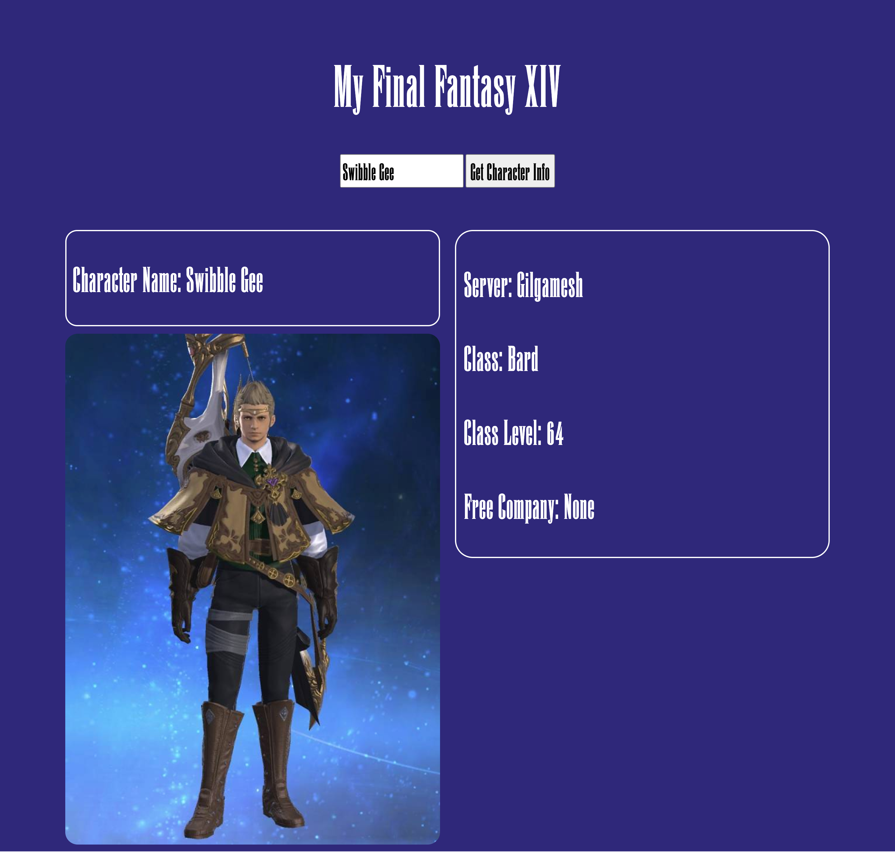
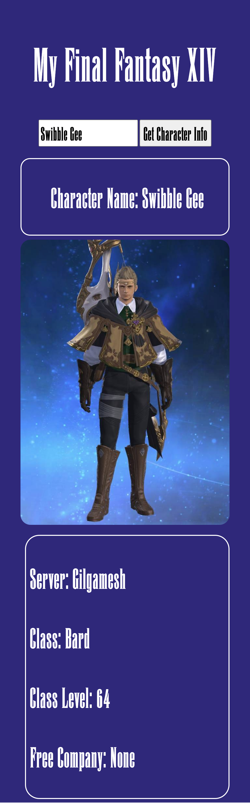

Final Fantasy XIV Companion App
================

A simple web application that allows users to search for a player's character information from the popular massively multiplayer online role-playing game, Final Fantasy XIV. The application fetches character information from an application programming interface (API) to populate information onto the web page.

Technologies Used 
================
 - HTML5
 - CSS3
 - Javascript
 - jQuery
 - Google Fonts
 - XIV API 
  
Screenshots
===============

Getting Started
===============
Here's the site
[link](https://final-fantasy-xiv.netlify.app/).

Future Enhancements
===============
- Include a search bar
- Add load spinner